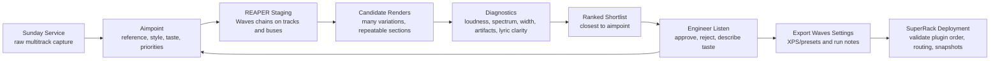

# Live Worship AI Product Demo Story

## The Story In One Sentence

Save the raw multitrack recording from Sunday, tell the AI what kind of worship mix you are aiming for, let it build and test many Waves-based mixes in REAPER at home, have the mix engineer listen and give taste feedback, then export the approved Waves chains into SuperRack for the next service.

This is not "AI replaces the mix engineer."

This is:

**A tireless virtual soundcheck assistant that can iterate after Sunday, learn the engineer's taste, and hand back live-ready Waves settings.**

## Product Promise

For a live worship mix engineer, the value is simple:

- Capture the service once.
- Iterate when the room is empty.
- Compare options without burning rehearsal time.
- Grade candidates against a clear musical aimpoint.
- Keep the human engineer as the final taste authority.
- Move approved Waves chains into SuperRack so the work is usable next Sunday.

The product is the workflow, not one magic prompt.

## The Workflow Loop



## What The Viewer Should Feel

By the end of the demo, a live worship mix engineer should think:

- "This could save me hours of virtual soundcheck time."
- "It understands worship priorities, not just generic mixing."
- "It can try more options than I realistically would."
- "It gives me a shortlist instead of drowning me in files."
- "It still lets me make the musical call."
- "The result can actually get into SuperRack."

## Demo Framing

Working title:

**AI Virtual Soundcheck For Live Worship Mix Engineers**

Alternative titles:

- **From Sunday Multitracks To SuperRack With AI**
- **I Built An AI Assistant For Worship Mix Engineers**
- **AI That Iterates Worship Mixes In REAPER And Exports To SuperRack**

Opening line:

> What if your Sunday multitrack recording could become a virtual soundcheck assistant during the week? Not just a chatbot giving mix tips, but a workflow that builds Waves chains in REAPER, renders candidates, grades them against your worship mix target, learns from your feedback, and exports the winning settings into SuperRack.

Core contrast:

- Generic AI advice: "Try compression and EQ."
- This product: "Here are five rendered candidates for your actual singer, graded against your church's aimpoint, with the winning Waves chain ready to export."

## The Demo Scenario

Use one real service recording and one clear target:

- Source: raw multitrack recording from a Sunday service.
- Host: REAPER at home or in the office.
- Plugin format: Waves plugins that can transfer to SuperRack.
- Aimpoint: natural, congregational, lyric-forward worship mix.
- References: approved local mix, target artist, or a private reference profile.
- Human reviewer: the live mix engineer or music director.
- Deployment: exported Waves settings or `.xps` files imported into SuperRack.

Recommended demo target:

Start with vocals or vocal bus because live engineers instantly understand the value. Then mention that the same loop works for drum bus, band bus, room mics, livestream bus, and speech mics.

## 12-15 Minute Video Outline

### 0:00 - Hook: The Whole Product In 30 Seconds

Show:

- REAPER multitrack session.
- Codex prompt.
- A ranked candidate report.
- SuperRack screenshot.

Say:

> This starts with a Sunday multitrack recording and ends with Waves settings I can use in SuperRack next Sunday.

Then show the loop quickly:

1. Define the worship mix aimpoint.
2. Let the AI build Waves candidates in REAPER.
3. Render and grade repeatable sections.
4. Listen to the shortlist.
5. Give feedback.
6. Export the approved chain to SuperRack.

### 1:00 - The Problem

Talk track:

> Most churches already have the most valuable training data they will ever get: their own Sunday multitracks. The hard part is time. The mix engineer cannot spend all week manually trying vocal chains, bus processing, room mic balances, and livestream masters. And if they do find something good in a DAW, it still has to transfer safely back to the live rig.

Show:

- The raw service recording.
- Track names: lead vocals, BGVs, drums, band, crowd/room, livestream bus.
- A rough or current mix section.

### 2:15 - The Aimpoint

Say:

> Before touching plugins, the system needs to know what good means. For worship, that is not just loud and polished. It is lyrics first, congregational support, low fatigue, natural dynamics, and a mix that fits this church.

Prompt:

```text
Use the worship mix skills.

I have raw multitracks from last Sunday's service and want to build a repeatable REAPER to SuperRack workflow.

Aimpoint: natural, congregational, lyric-forward worship mix. Lead vocal clearly carries the lyric, BGVs support without pulling focus, band feels warm and alive, crowd/room mics help the livestream feel connected to the room without smearing intelligibility.

Deployment: Waves plugins in REAPER first, then export approved settings to SuperRack.

Give me the mix hierarchy, the sections we should render, and the objective failures we should reject before listening.
```

Expected response:

- Lyrics and lead vocal first.
- Render sparse verse, first chorus, biggest chorus/bridge, late-service section.
- Reject clipping, silent renders, static, pumping, harshness, mono collapse, and lost intelligibility.
- Keep plugin choices compatible with SuperRack.

### 4:00 - Candidate Generation In REAPER

Say:

> Now the workflow stops being advice and becomes iteration. The assistant can build several conservative Waves chains, render the same song sections, analyze them, and keep a run log.

Prompt:

```text
Create a first candidate batch for the lead vocal and vocal bus.

Use live-safe Waves-style chains that could transfer to SuperRack.
Keep each chain serial.
Generate a conservative baseline, a clarity-focused candidate, a warmer candidate, and a more controlled candidate.
Render the same 20-30 second sections for each and prepare a ranked listening shortlist.
```

What to show:

- REAPER FX chain being created or inspected.
- Candidate folders/renders.
- A compact table of candidates.
- The assistant rejecting a bad render or flagging clipping if it happens.

Value message:

> The AI is not guessing from a screenshot. It is printing audio, measuring it, comparing it, and keeping the tests repeatable.

### 6:30 - Diagnostics And Grading

Say:

> The grading is not "which file is loudest." It checks whether the candidate moved toward the aimpoint and whether it created live problems.

Show a candidate report with fields like:

- Section name.
- LUFS or RMS.
- Peak and clipping status.
- Crest/dynamics.
- Frequency balance.
- Stereo width and mono compatibility.
- Artifact gate.
- Notes on lyric clarity, low-mid buildup, harshness, and ambience.

Prompt:

```text
Compare these candidates like a live worship mix engineer.

Rank them by fit to the aimpoint, but reject any option with clipping, obvious artifacts, excessive pumping, harshness, low-mid buildup, or reduced lyric intelligibility.

Give me the top two candidates for human listening and explain the tradeoff in plain mix language.
```

Expected result:

- Top candidate.
- Runner-up.
- Why each fits or misses.
- What the engineer should listen for.

### 8:30 - Human Feedback Improves The Product

Say:

> This is the important part: the engineer still makes the taste call. The system gives a shortlist, the human listens, and their feedback becomes the next aimpoint.

Example feedback:

```text
I like candidate B better. Candidate A is clearer, but B feels more natural and less processed. Keep that vocal density, but give me a little more consonant clarity in the chorus.
```

Then show how the assistant turns that into a new iteration:

- Preserve the preferred chain character.
- Add a small targeted presence or dynamic EQ move.
- Avoid making the vocal feel over-processed.
- Render the same sections again.
- Compare against the previous winner.

Optional real example:

Use the crowd-mic story as a proof point:

> In one test, the metrics originally preferred very conservative room mics. But the music director preferred crowd mics around `-9 dB` because the stream felt more like the room and the singers felt less exposed. That taste call became a new local aimpoint, and the next iteration protected lyric clarity with gentle ducking instead of simply turning the room back down.

### 10:30 - Export To SuperRack

Say:

> Once the engineer approves the sound, the result cannot stay trapped in REAPER. The whole point is to get it back into the live system.

Show:

- Exported Waves settings or `.xps` folder.
- SuperRack screenshot.
- Optional session inspection output.

Prompt:

```text
Prepare this approved REAPER Waves chain for SuperRack handoff.

Document plugin order, mono/stereo format, source track, intended rack, latency concerns, bypass state, and any settings that need to be verified after import.

Then give me a SuperRack validation checklist before this is used in a service.
```

Expected response:

- Plugin order and chain notes.
- Export paths.
- SuperRack import or validation checklist.
- Confirm plugin compatibility, bypass state, disabled state, snapshots, sidechains, routing, and latency.

Value message:

> This is where the product becomes practical for churches. It does not end with a pretty DAW mix. It produces settings the live engineer can actually audition and deploy.

### 12:30 - Close

Say:

> The vision is simple: every Sunday multitrack becomes a chance to improve the next Sunday. The engineer gives the target and makes the final calls. The AI does the repetition: building chains, printing tests, checking failures, ranking options, remembering taste, and preparing the SuperRack handoff.

Closing line:

> It is virtual soundcheck with memory.

## Short 90-Second Pitch

> Churches already record the raw material they need to improve their mixes: Sunday multitracks. This workflow turns those recordings into a weeklong virtual soundcheck assistant. You define the worship mix aimpoint, like lyric-forward, natural, congregational, and low-fatigue. The agent stages Waves plugin chains in REAPER, renders multiple candidates across the same song sections, rejects broken or unsafe renders, grades the candidates against the aimpoint, and gives the mix engineer a shortlist to listen to. The engineer gives feedback, the tool updates the target, and it iterates again. When the mix feels right, the approved Waves chains can be exported into SuperRack and validated for the live rig. So the AI is not replacing the engineer. It is doing the tedious iteration and handoff work so the engineer can make better decisions faster.

## Key Product Messages

- **Own your church's sound:** The aimpoint can be based on your church, your room, your music director, and your engineer's taste.
- **Use real audio:** Decisions come from rendered multitracks, not abstract advice.
- **Iterate more than a human has time to:** Try many chains and settings without manual busywork.
- **Keep the human in charge:** The engineer listens to the shortlist and gives feedback.
- **Make feedback durable:** Taste calls become future rules, not forgotten comments.
- **Stay live-safe:** Plugin choices and chain topology are filtered for SuperRack reality.
- **Close the loop:** Approved REAPER settings become SuperRack-ready handoff material.

## On-Screen Proof Points

Show these instead of only talking:

- Raw multitrack session from a service.
- Aimpoint prompt and response.
- REAPER Waves chains being staged.
- Candidate render folders.
- Candidate ranking table.
- A bad render being rejected because of clipping, silence, static, or artifacts.
- Human feedback becoming a new iteration.
- Exported Waves presets or `.xps` files.
- SuperRack validation checklist or screenshot.

## Sample Candidate Table

```text
Candidate            Goal                 Result
baseline             current mix           useful reference, vocal inconsistent
vocal_clarity_01      lyric clarity         clearer consonants, slightly bright
vocal_warmth_01       natural warmth        smoother, less forward
vocal_control_01      level stability       best lead consistency, no clipping
vocal_refined_02      feedback revision     best aimpoint fit, send to engineer
```

## What Not To Claim

Avoid saying:

- The AI automatically creates a perfect mix.
- The engineer no longer needs to listen.
- Metrics decide what sounds good.
- A DAW mix always transfers perfectly to the live rig.

Say instead:

- The system creates better starting points.
- The engineer approves the sound.
- Metrics catch failures and guide comparisons.
- SuperRack validation is part of the workflow.

## Recording Checklist

Before recording:

- Prepare one sanitized REAPER project or a copy of the service multitrack.
- Pick one target source such as lead vocal, vocal bus, or livestream bus.
- Prepare two or three rendered audio examples: raw/current, candidate, refined.
- Prepare a simple aimpoint statement.
- Open the workflow doc and README.
- Open SuperRack or prepared SuperRack screenshots.
- Hide private paths, singer names, licenses, and church-sensitive routing if needed.

Video structure:

1. Show the whole loop first.
2. Demonstrate one source deeply.
3. Show human feedback.
4. Show export/handoff.
5. End by restating the product promise.

Editing notes:

- Use chapters: `Capture`, `Aimpoint`, `Iterate`, `Grade`, `Feedback`, `SuperRack`.
- Do not spend too long reading prompts.
- Let the before/after clips breathe for a few seconds.
- Use callouts for `human taste call`, `artifact rejected`, and `SuperRack-ready`.

## Suggested Video Description

```text
This demo shows a live worship mix workflow built around custom AI skills: save raw multitracks during a service, define a worship mix aimpoint, iterate Waves plugin chains in REAPER, render and grade candidates, collect mix engineer feedback, and export approved settings into SuperRack for the next service.

The goal is not to replace the engineer. The goal is to turn every Sunday recording into a practical virtual soundcheck loop that helps the engineer make better, faster, live-ready decisions.
```

## Follow-Up Video Ideas

- Lead vocal chain shootout: AI-generated Waves candidates vs engineer feedback.
- Full vocal bus workflow from raw multitrack to SuperRack export.
- Livestream bus mastering pass for YouTube delivery.
- Room/crowd mic aimpoint: why human taste can beat metric-only scoring.
- WING snapshot and SuperRack routing validation.
- Building a reusable church-specific worship mix aimpoint.
