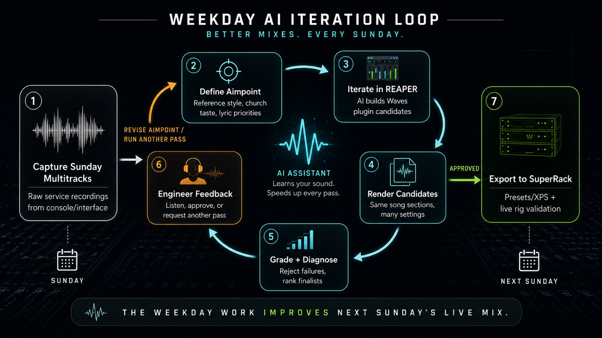

# REAPER to SuperRack Iteration Workflow

Use REAPER for fast Waves chain iteration, then use SuperRack session-file tooling for deployment validation. Treat SuperRack UI automation as a fallback for no-reload operations, not the default creative loop.

## When To Use This

Use this workflow when developing Waves plugin chains for worship vocals, speech, band buses, drum buses, livestream buses, or other processing that must eventually run in Waves SuperRack SoundGrid or SuperRack Performer.

This workflow is strongest when the goal is to compare tone, dynamics, intelligibility, artifact risk, and reference fit before touching a live SuperRack session.

## Skills Involved

- `band-sound-aimpoint`: define the target sound, reference family, and taste vocabulary.
- `live-worship-mix-engineering`: diagnose the current mix and choose practical next moves.
- `waves-live-plugin-chains`: choose live-safe Waves chains that can survive SuperRack deployment.
- `reaper-session-automation`: stage chains in REAPER, manage render settings, create controlled snippets, and capture transfer notes.
- `mix-render-diagnostics`: compare rendered candidates against baselines, references, and delivery-risk checks after trustworthy audio exists.
- `superrack-session-files`: inspect `.sprk` and `.xps` files, validate imported chains, and safely patch known session state.
- `behringer-wing-snap`: verify WING routing, SoundGrid channels, external inserts, and snapshot scope when the console routing matters.

## Preferred Loop

1. Define the target: source, mix goal, reference, target bus or rack, and constraints such as latency or volunteer safety.
2. Pick a conservative Waves chain with `waves-live-plugin-chains`, using only plugins and topology that SuperRack can run live.
3. Stage the candidate in REAPER with `reaper-session-automation`, keeping the chain serial and disabling ReaInsert or live hardware effects during offline renders.
4. Render controlled snippets: raw baseline, known-good baseline, then candidate sections such as sparse verse, dense chorus, and late-service energy.
5. Analyze with `mix-render-diagnostics` and listen: reject clipping, static, harshness, pumping, low-mid buildup, phase trouble, or lost lyric clarity before doing full-length renders.
6. Export the approved Waves settings or rack-chain `.xps` when possible, and record plugin versions, mono/stereo format, sample rate, latency mode, and changed controls.
7. Bring the chain into SuperRack through a native import or a cautious `.sprk`/`.xps` file workflow.
8. Validate deployment with `superrack-session-files`: plugin order, bypass state, disabled state, sidechains, rack routing, snapshots, recall-safe state, latency, and SQLite integrity.
9. If WING routing is part of the system, compare the relevant `.snap` with the SuperRack session so channel numbers, buses, and inserts line up.
10. Keep local renders, sessions, presets, screenshots, and taste-call notes out of the public repo.

## Default Judgment

Prefer REAPER for sound design and comparison. Prefer SuperRack files for deployment inspection and validation.

SuperRack UI automation can help when a reload or import is too disruptive, but it is inherently screen-dependent. It should use screenshots, logs, and current-state database diffs around each action, and it should stop if the visible state does not match expectations.

Avoid direct memory editing of SuperRack. Treat the running app as holding active state in memory and writing persistence files, not as a live-editable SQLite control surface.

## ReaInsert And Live SuperRack

Using ReaInsert or live I/O into SuperRack can be useful when the real hardware path matters, such as latency, console routing, SoundGrid I/O, or final deployment confidence.

For ordinary tone iteration, direct Waves plugins on REAPER tracks are usually better:

- faster offline renders
- repeatable candidate comparisons
- simpler gain matching and artifact checks
- less dependence on window focus or mouse coordinates
- cleaner transfer through Waves presets or `.xps` exports

Use live SuperRack control only for final confirmation, emergency no-reload changes, or workflows that REAPER cannot faithfully model.

## Handoff Checklist

Before calling a candidate ready for SuperRack:

- The REAPER candidate has passed raw/baseline/candidate render checks.
- The chosen chain is serial and uses SuperRack-compatible Waves plugins.
- Gain changes are intentional and documented.
- Any exported preset or `.xps` has been inspected.
- The SuperRack session copy passes `PRAGMA integrity_check` and `PRAGMA foreign_key_check`.
- Active state and stored snapshots have been compared when snapshot recall matters.
- Sidechains are checked at both the rack assignment level and the plugin detector/source level.
- Latency and bypass/disabled state are verified after import or patching.
